# REMAP-Web-Server
A web server allow biologists to identify miRNA, single nucleotide polymorphism, simple sequence repeats and many more in a faster way at a single platform with less endeavors.

Instruction:
Web server requires a linux based server installed with python 3 to become fully functional.
Necessary packages must be installed on the server before running the web application,
There are text file inside the folders that contain information regarding the packages to be installed.

Home Page:

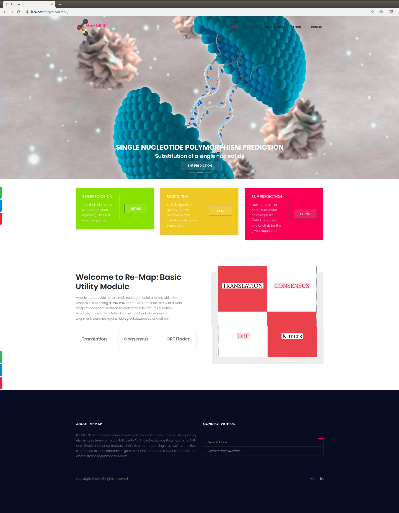

Tool:

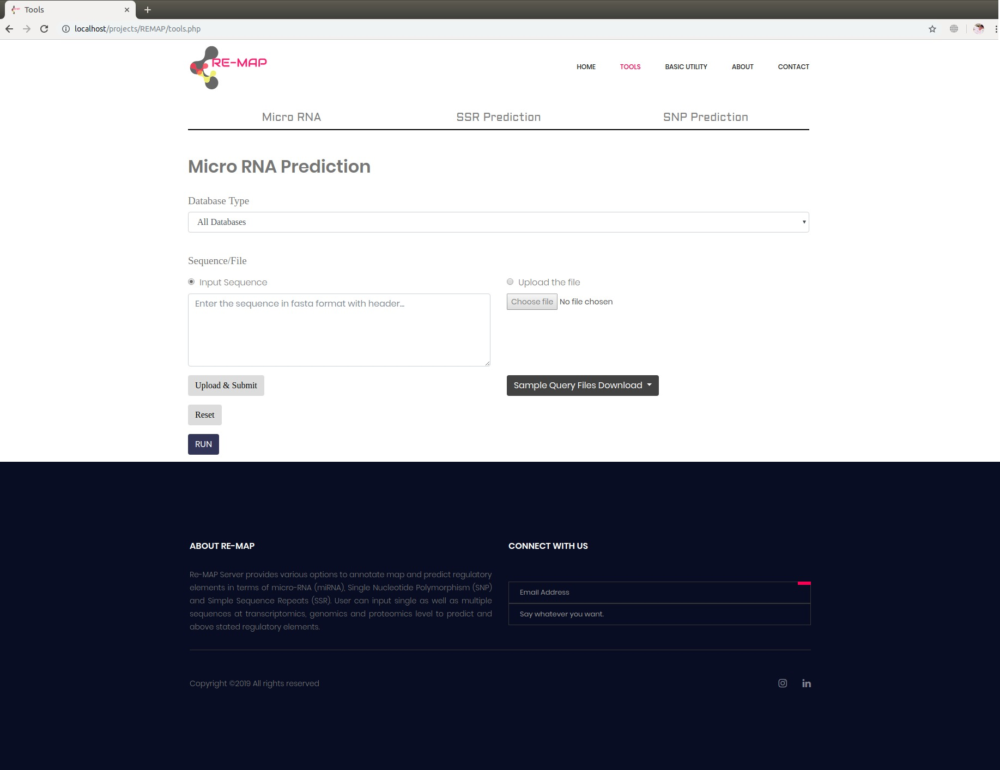
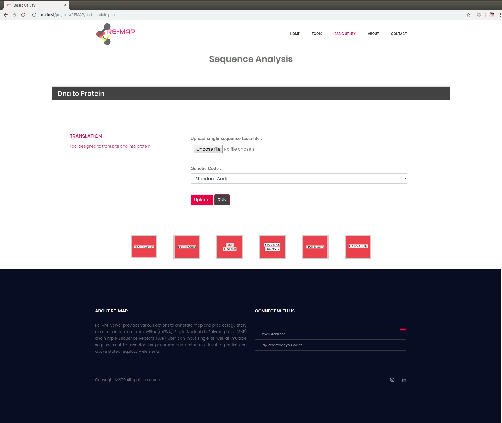
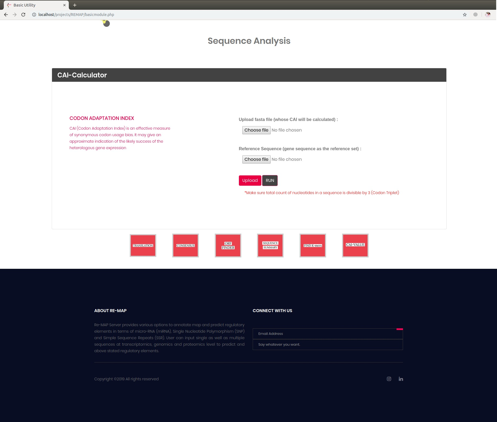

Result:

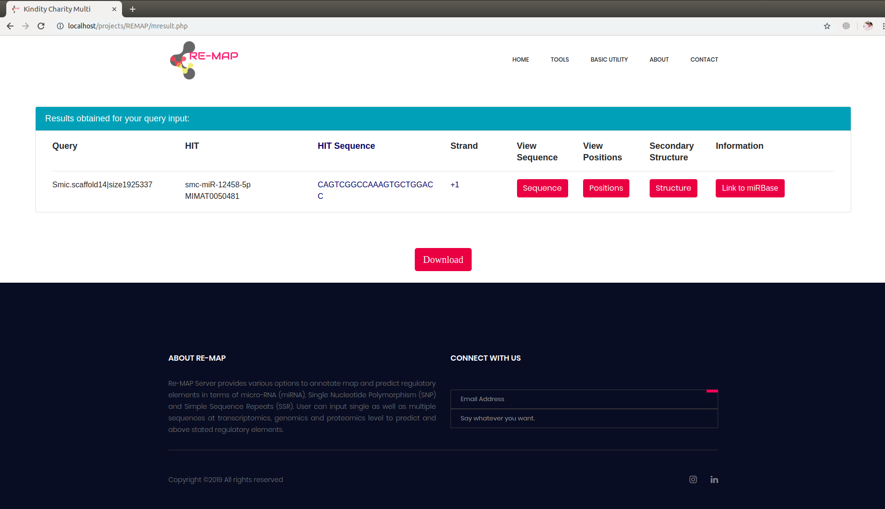
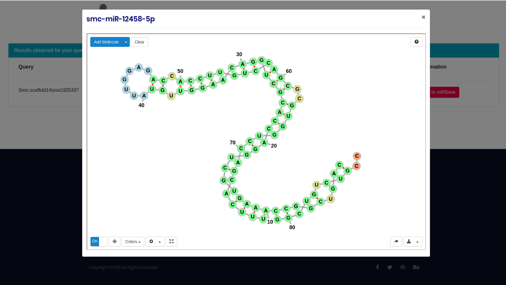
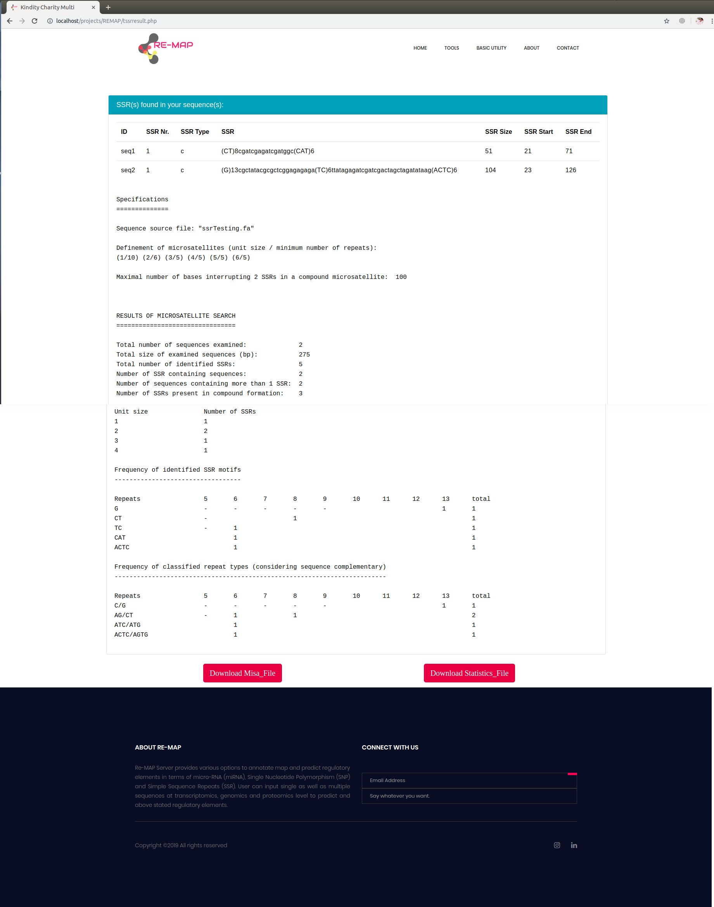
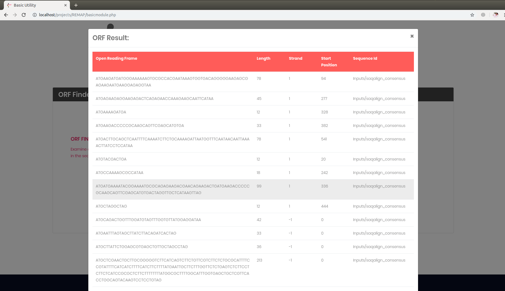
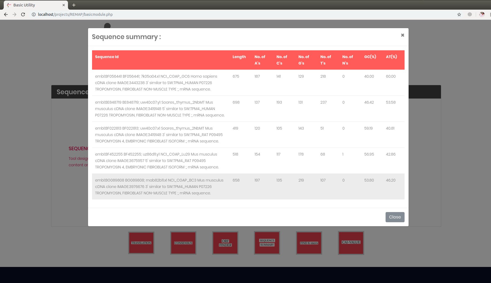
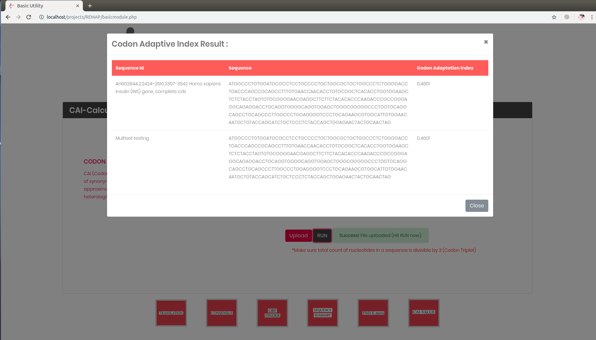

Contact Page:

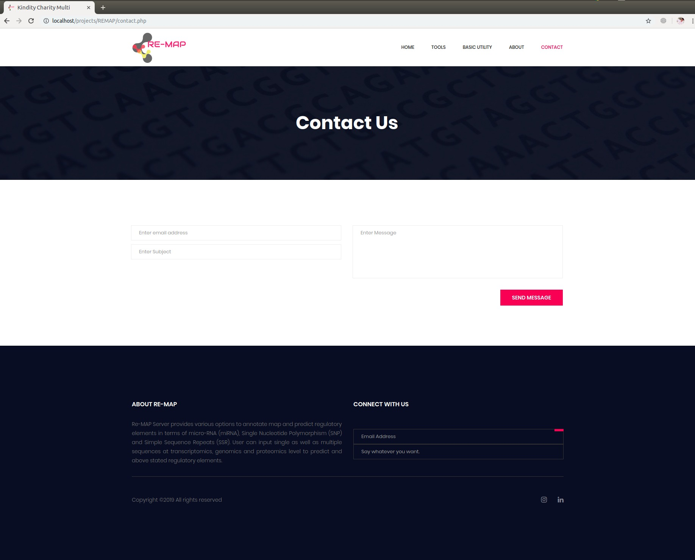
